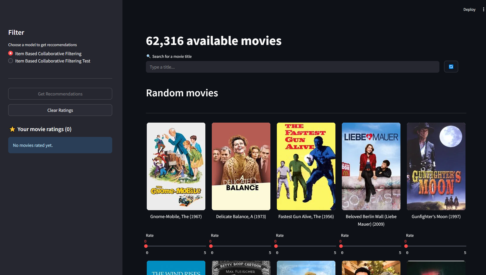

# Movie Recommender WebUI - A Streamlit implementation
This folder holds the script for our streamlit WebUI implementation. 

## Overview
The WebIU consists of three main sections:
- **The sidebar**: Here the user can decide which model should give the recommendations. Furthermore (after rating at least 5 movies) recommendations can be requested from the choosen model which will be displayed in the main section of the screen. Already rated movies can also be cleared again. Every time a user rates a movie the poster, name and rating of the movie(s) are displayed in a list.
- **The Upper Main section**: Here we display the total number of availible movies and offer the possibility to search for movie titles. The little button to the right offers the functionality to get new 20 random movies.
- **The Lower Main section**: Here the heading changes depending if the displayed movies are random/searched or recommended (returned by the choosen model) 

## Development
This section mainly focuses on integrating new model into the source code. The scipt has it's entrypoint in the `app.py` where the entire **streamlit** WebUi layout and moste of the state management takes place (I tried to improve the state management but failed miserably). The `utils.py` hold some helper functions which aim to decluter the main `app.py` script (I am not really happy with it - open for suggestions).

> ⚠️ Keep in mind that a streamlit app reruns the script on each user interaction therefore managing state with this library is a nightmare - at least I don't know a better solution for now

### Adding a new model
For adding new models a **interface** (or whatever you guys call it in Python) `Model` was implemented. This defines two functions which need to be implemented by every new model `load` and `recommend`. One example of implementation can be found [here](./models/itemBasedCollaborativeFiltering.py). 

- **load**: loads the **pkl** file from the provided `path`
- **recommend**: implement the recommendation logic for the model. This functions takes a **dict** object (of rated movies) and a **int** which is the nummber of desired recommendations. The return value has to be a **list** of `item_ids`
 
The switching between models takes place in the sidebar by selecting a model via radiobuttons. Currently the `Item Based Collaborative Filtering` model is loaded by default and there is a possibility to switch to a test model (which does not work - but the switching does). Example can be found in [app.py](./app.py#L104-L121)
